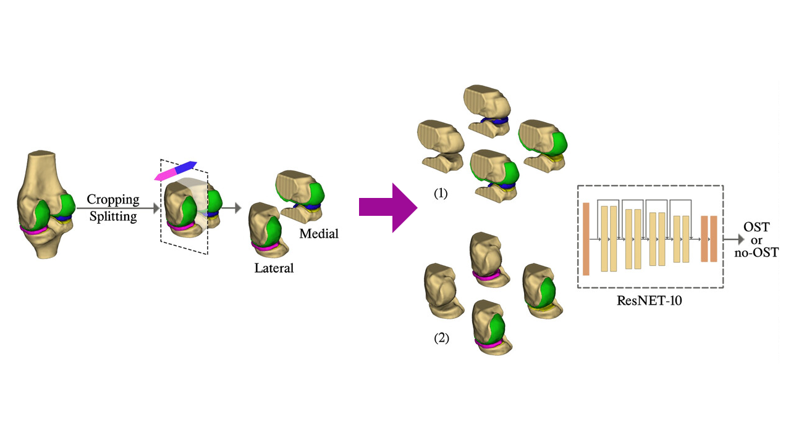

# Osteophyte detection based on 3D morphology from MRI

This repository contains the code for deep learning-based detection of osteophytes in knee MRIs using 3D morphology. This model is a part of the methodology outlined in the paper entitled "<a href="https://onlinelibrary.wiley.com/doi/10.1002/jor.25800">Deep learning based detection of osteophytes in radiographs and magnetic resonance imagings of the knee using 2D and 3D morphology</a>".

ResNet-10 was employed in this repository. To detect osteophytes in medial compartments (medial femoral and medial tibial), medial part of the bone mask and for the lateral ones (lateral femoral and lateral tibial), corresponding part was fed to the network.

